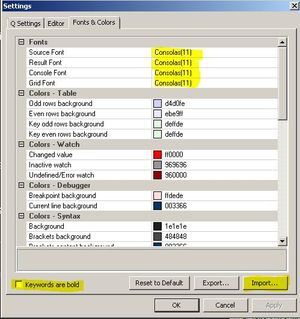

# QPad-Dark-Scheme
Dark color scheme for Q Insight Pad (like in VS code and Sublime)

1. Launch QPad -> Q -> settings -> Fonts & Colors -> Import -> select  *qpad-dark-scheme* file
2. Fonts -> Consolas(11) (for all fonts), Uncheck -> Keyword are bold 
   * 
3. View ->Application Look -> Office 2007 -> Black Style  
